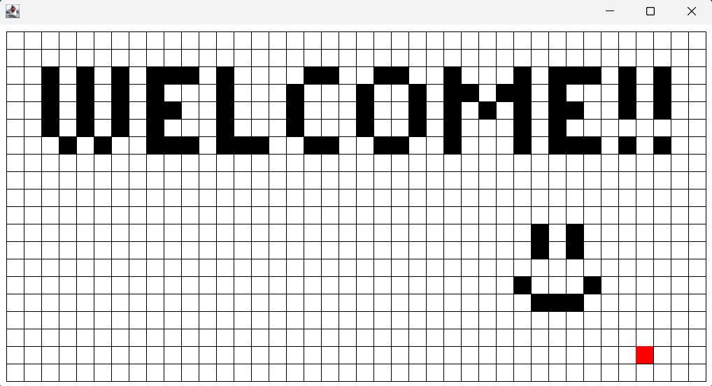

# MapEditor
 MapEditor is a simple Java graphics program that lets you paint a grid of cells using keyboard inputs.
 
 Done during Academia de Código' bootcamp, this project uses the **org.academiadecodigo.simplegraphics** library for graphics manipulation. https://github.com/academia-de-codigo/simple-graphics

## Keyboard:

**Arrow keys**: Move Up, Down, Left or Right. 

**Space**: Fill the cell under the cursor with black/ Clear an already painted cell.

**S**: Save the current state of cells to a file.

**L**: Load previously saved cells.

**C**: Clear all cells from the grid.
 
 

## Java Mechanics and Principles:
### Inheritance
The Cell class extends the Rectangle class, inheriting its properties and behaviors.

### Encapsulation
The Cell class encapsulates the state of a cell, managing its painted state and exposing methods to access and modify it.

### Polymorphism
The draw() method is polymorphic, being invoked differently in subclasses Cursor and GridField.

### Abstraction
Abstraction is employed by creating classes like Cursor and GridField to represent real-world concepts without exposing all the implementation details.

### File I/O
File input/output is used to save and load grid configurations in/from a text file (grid.txt). This involves classes like FileReader, BufferedReader, FileWriter, and BufferedWriter.

### Event Handling
The project handles keyboard events (KeyboardHandler) to control the cursor's movement and interaction with the grid.

### Collections
The GridField class extends ArrayList<Cell>, utilizing a collection to manage and manipulate grid cells efficiently.

### Exception Handling
Exceptions (e.g., IOException) are handled when dealing with file operations (try-catch blocks).

## Screenshot:

